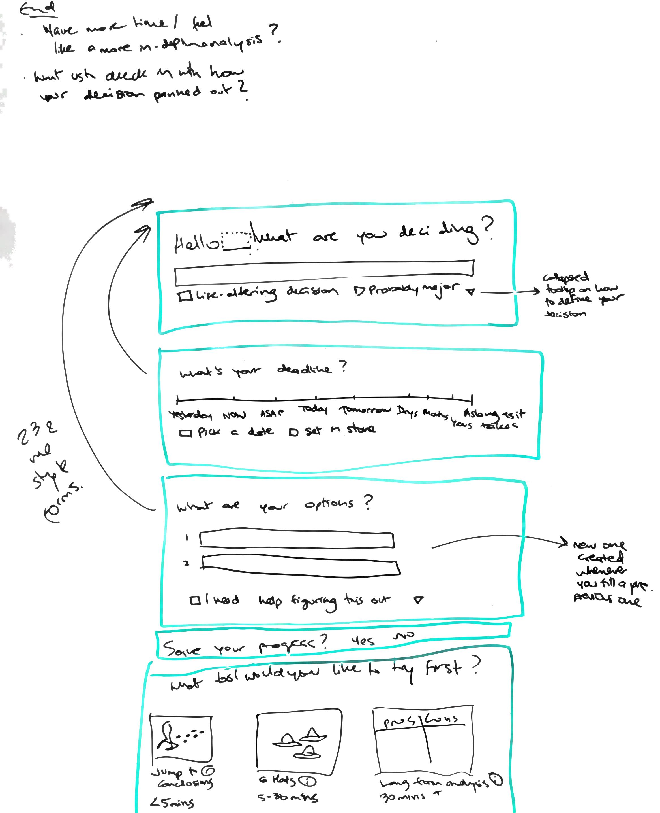
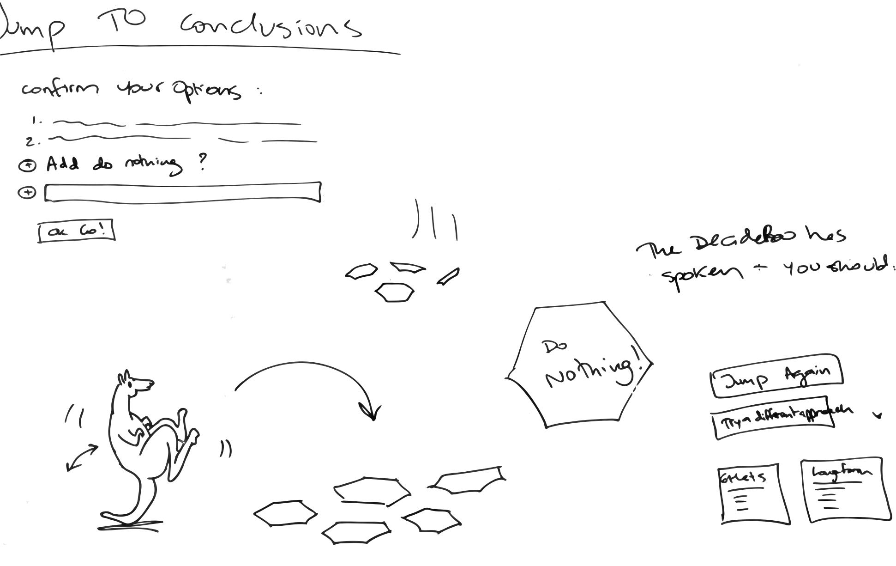
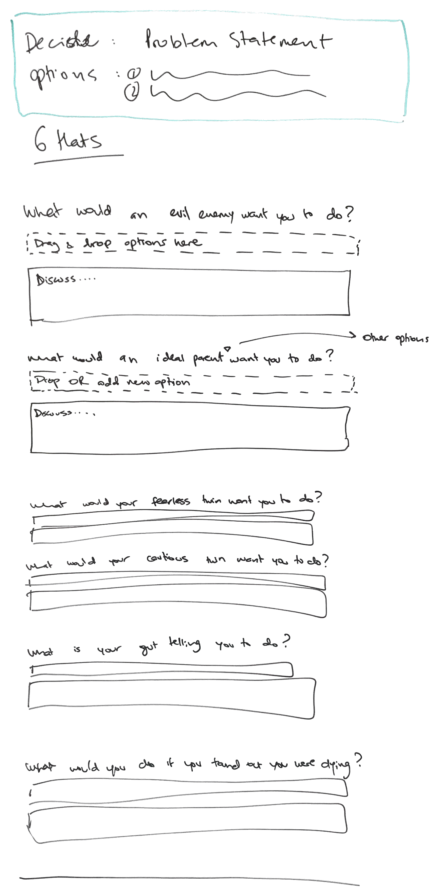
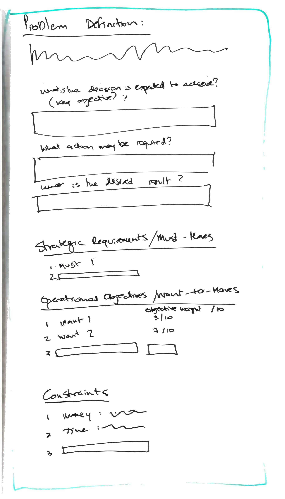
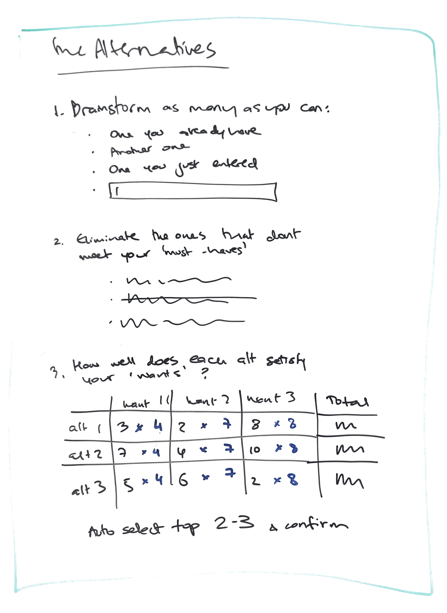
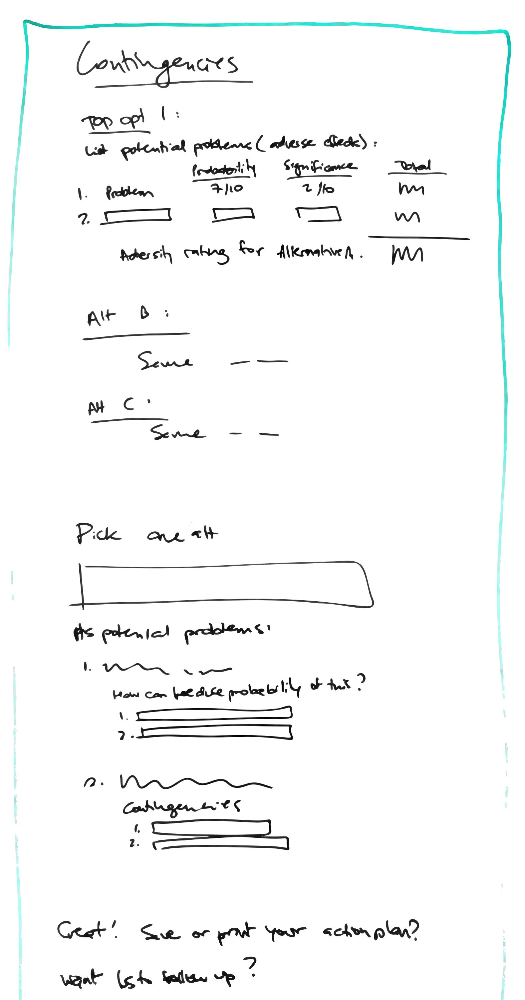

# DecideRoo

## Scope

A simple set of tools to facilitate the decision-making process for indecisive individuals like myself. There will be three tools that can be interchangeably be used to examine the decision to be made:

1. Jump to Conclusions - think angry birds featuring a kangaroo that lands at random on one of your options.
2. 6 hats - consider your conundrum from 6 different perspectives, drag & drop your decision options to what you think each perspective might endorse, and optionally discuss each perspective.
3. Long-form analysis - this one will give you tools and options to dig deeper into your problem definition, context and compare and contrast decision options using weighting scales.

## User stories

- AAU I should at minimum be able to enter the decision I'm trying to make and the options I'm considering, then work through a tool or two before deciding if I want to set up an account and store this information or to obliterate it for ever or to download it as a pdf for my own private record.

- AAU I should be able to get help and additional tools for each step of the way, like defining my decision, figuring out what my deadline is, what my options are etc.

- AAU I should be able to carry over the decision options I'm considering from one tool to the next. 

- As a registered user I should be able to create multiple decisions and switch between them.

- As a registered user with saved decisions that have been made I should have the option to reflect on them post-factum.

## Wireframes

## Data Models

## Milestones

#### MVP
Fri 1 - Tue 5
- Homepage with defining the decision
- Jump to conclusions game
- 6 hats form
- Lengthy mathsy analysis

#### Important
Wed 6
- User registration & login
- Saving decisions & commenting on past decisions

#### Other features
Thur 7 - Fri 8
- Follow-ups & patterns
- Other decision-making tools

#### Other things
Sat 9 - Monday 11
- UI
- Animate the roo
- Deploy
